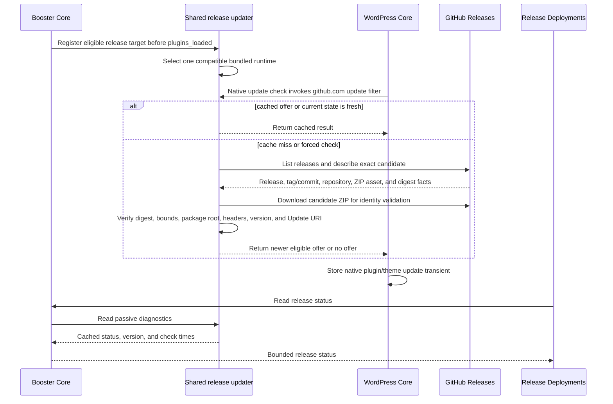
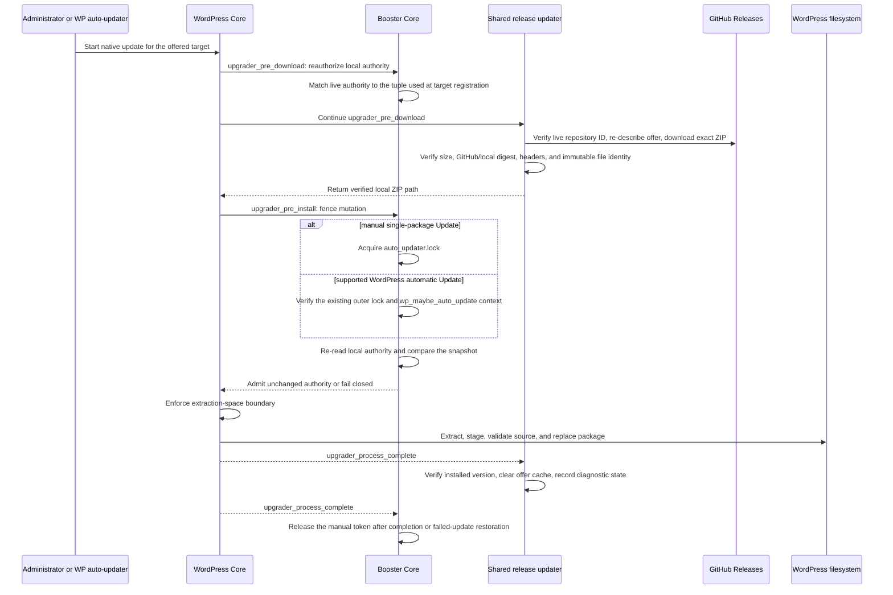

# Package update orchestration

## Purpose

This guide explains how an already managed plugin or theme moves from a remote
source to WordPress's filesystem. It covers the two runtime mechanisms:

- a package tracking published GitHub Releases; and
- a package tracking a Git branch, updated either manually or by Push-to-Deploy.

The active paths are prospective release installation, native release Update,
and tracked-branch deployment. All use WordPress's installer. Prospective and
branch operations acquire Booster's wrapper for WordPress's updater lock.
Native Update stays in WordPress's update transaction while Booster snapshots
local authority before remote work and fences mutation with that same lock.
The paths do not share discovery, archive acquisition, scheduling, or
operational history.

> A Git branch named `release/*`, including a Release Please release-PR branch,
> is still a **branch source**. It becomes a **published-release source** only
> after an eligible GitHub Release and its conforming assets have been
> published. Release Please prepares versioning, tags, and releases; it is not
> a runtime deployment engine and does not make WordPress ZIPs by itself.

## Decision history

Before proposing a new updater, installer, lock, receipt, credential lifecycle,
public facade, or shared release/branch abstraction, review the private package
update decision register. It preserves material NO-GO and deferred approaches,
their evidence, and the specific triggers that would justify reconsideration.
That audit trail does not override the current runtime behavior documented here.
In particular, the register is the durable history for the removed exact
release Reinstall path and its receipt/finalizer NO-GO; this guide does not
present that retired operation as current behavior.

Booster's own update target has a separate installation-provenance gate. See
[Booster Core self-updates](core-self-updates.md) for the official-package
marker, source-checkout protection, explicit override, runtime-only handoff,
administrator messaging, and release proof.

## The short model

There is one installer but three operational paths:

| Responsibility              | Prospective release install              | Native release Update                       | Tracked branch                                        |
| --------------------------- | ---------------------------------------- | ------------------------------------------- | ----------------------------------------------------- |
| Administrator-facing intent | Release selection and install in Booster | WordPress UI or automatic updater           | Booster Core                                          |
| Remote discovery and trust  | Shared release-updater preflight         | Shared GitHub release updater               | Registered repository provider plus Booster preflight |
| Durable deployment attempt  | No                                       | No                                          | Yes                                                   |
| Queue and worker            | Synchronous protected request            | WordPress's native update system            | Booster attempt table and, for queued work, WP-Cron   |
| Archive downloader          | Shared release-updater preflight         | Shared release updater                      | Booster archive preflight                             |
| Filesystem installer        | WordPress Core                           | WordPress Core                              | WordPress Core                                        |
| Mutation serialization      | Booster acquires `auto_updater.lock`     | Core reuses or acquires `auto_updater.lock` | Booster acquires `auto_updater.lock`                  |
| Final verification          | Core install and adoption postconditions | Updater and Core completion observers       | Booster coordinator postconditions                    |

Booster does not clone a repository into a plugin or theme directory. All three
paths hand one local ZIP to WordPress. WordPress extracts, replaces, maintains
maintenance mode, and applies its normal temporary-backup or rollback
behaviour.

## Ownership and handoff points

| Owner                         | Authority                                                                                                                                                                                                                                     |
| ----------------------------- | --------------------------------------------------------------------------------------------------------------------------------------------------------------------------------------------------------------------------------------------- |
| Release Deployments add-on    | Renders release state and actions and passes bounded intent to Core facades. It does not receive credentials, download archives, schedule updates, or mutate package files.                                                                   |
| Booster Core                  | Owns package source and revision, deployment policy, credentials, facade authorization, prospective adoption, native-update authority snapshots and locking, branch admission/history, branch preflight, and final management postconditions. |
| Shared GitHub release updater | Owns release discovery, channel selection, caching, stable repository-ID checks, exact release/ZIP/digest identity, package-header validation, archive custody, optional rejection-only assurance, and native WordPress update hooks.         |
| Repository provider           | Resolves a branch or authenticated webhook revision and prepares its authenticated archive URL, credentials, stable repository ID, immutable ref, and expected-head verifier when required.                                                   |
| WordPress Core                | Triggers native checks and automatic updates, stores update transients, invokes the upgrader, extracts and replaces files, reports completion, and performs native restoration.                                                               |
| Booster deployment worker     | Claims at most one queued branch attempt during a real WP-Cron run and invokes the same coordinator used by synchronous manual deployment.                                                                                                    |

The word **Core** below means Booster Core unless the text says **WordPress
Core**.

## Optional release assurance checker

The selected updater runtime fires
`ran_wp_github_release_updater_v1_assurance_registration` once, before it
constructs release clients or targets, passing its request-local
`ReleaseAssurance`; it then seals registration. A listener may call
`ReleaseAssurance::register(callable(array<string, mixed>): mixed $checker): bool`
to register exactly one checker. The checker runs only after the updater's
built-in release, digest, archive and plugin-or-theme package checks have
passed.

The callback receives only these normalized, non-secret evidence fields:

- release and repository: `repository`, `provider_repository_id`, `release_id`,
  `tag`, `version`, `commit`, `prerelease` and `immutable`;
- ZIP: `zip_asset_id`, `zip_name`, `zip_size`, `github_sha256` and
  `local_sha256`; and
- `candidate_validation`: `state`, `code`, `release_tag`, `release_version`,
  `package_header_version`, `requires_php`, `requires_wordpress`, plus
  `identity` containing `release_id`, `tag`, `zip_asset_id`, `sha256`,
  `package_type` and `header_file`.

Returning `null` adds no rejection; returning `WP_Error` rejects the candidate.
A thrown exception, any other return type or duplicate registration fails
closed. A supplied error code is sanitized and bounded; the updater otherwise
uses `github_updater_release_assurance_duplicate`,
`github_updater_release_assurance_failed`,
`github_updater_release_assurance_invalid_result` or
`github_updater_release_assurance_rejected`. A checker cannot waive a built-in
failure, receive credentials or archive paths, download or install the package,
or mutate updater state. With no checker, the built-in checks remain mandatory.
Automatic mode additionally requires the updater-owned stable repository ID
and immutable published-release profile at offer time and fresh pre-install;
manual mode does not claim that stronger publication property. `package_type`
and `header_file` preserve the same seam for plugins and themes.

The `immutable` boolean is GitHub-reported release metadata, not proof that the
release attestation or a separate Artifact Attestation was cryptographically
verified. GitHub says an immutable release locks its tag and assets after
publication and automatically creates a release attestation; verification is a
separate consumer action. A future assurance add-on owns that policy, its
attestation retrieval and cryptographic verification against the supplied
release identity and locally calculated SHA-256. It rejects mismatches through
this checker without adding GitHub-specific policy or dependencies to Booster
Core or weakening the updater's existing checks. See
[GitHub's immutable releases](https://docs.github.com/en/code-security/concepts/supply-chain-security/immutable-releases)
and
[release integrity verification](https://docs.github.com/en/code-security/how-tos/secure-your-supply-chain/secure-your-dependencies/verify-release-integrity).

## Booster Core is a separate native target

Booster's self-update target is not a managed package and does not use branch
deployment, Release Deployments, stored provider credentials, or deployment
activity. Core always registers the target early enough to participate in
shared-updater runtime arbitration. Whether that target also joins WordPress's
native discovery and installer hooks is decided separately.

In the default `auto` mode, only a verified release installation carrying the
build-generated `ran-booster-release.json` marker may consume the configured
Core release feed. Source checkouts and unverified directories remain
runtime-only: the updater runtime and prospective API are retained, but no Core
self-update feed request, native offer, upgrader hook, or updater notice is
created. The current Core repository is private and Core's shipped updater
registration carries no credential, so anonymous discovery fails closed with
`404`; the temporary token shim used for release proof is not product UX.

An operator may force `enabled` only for a disposable update test or force
`disabled` as a narrow site-level freeze. Enabled Core discovery remains
manual-only because Core passes the updater's forced-off automatic policy.
These controls do not change managed plugin or theme release policies.

## Trigger matrix

### Published-release tracking

| Trigger                    | Initiator                                                                                 | Immediate handoff                                                                                                          | Can download a ZIP?                           | Can change files? |
| -------------------------- | ----------------------------------------------------------------------------------------- | -------------------------------------------------------------------------------------------------------------------------- | --------------------------------------------- | ----------------- |
| **Use published releases** | Administrator in Release Deployments                                                      | Add-on handler → Core facade → forced updater preflight → atomic source transition                                         | Yes, for eligibility and identity validation  | No                |
| Request bootstrap          | Booster                                                                                   | Registers each eligible managed target with the shared updater before `plugins_loaded` selects one bundled updater runtime | No                                            | No                |
| Normal update check        | WordPress scheduled or administrator-driven update check                                  | WordPress calls the updater's host-specific update filter                                                                  | Yes, for candidate validation on a cache miss | No                |
| **Check releases**         | Administrator in Release Deployments                                                      | Add-on handler → Core facade → updater cache clear → WordPress native update check                                         | Yes, for fresh candidate validation           | No                |
| Prospective **Install**    | Administrator selecting an exact release                                                  | Core prospective facade → updater preflight → Core installer and adoption                                                  | Yes, one exact installation archive           | Yes               |
| Native **Update**          | Administrator on a WordPress update surface                                               | WordPress upgrader → shared updater pre-download hook                                                                      | Yes, one fresh installation archive           | Yes               |
| Native automatic update    | WordPress's own automatic-updater run, when its final policy decision permits the package | WordPress upgrader → shared updater pre-download hook                                                                      | Yes, one fresh installation archive           | Yes               |
| Status rendering           | Release Deployments                                                                       | Add-on gateway → Core facade → passive updater diagnostics                                                                 | No                                            | No                |

There is no Booster release scheduler. **Automatic** makes the updater return an
affirmative native auto-update decision. **Manual** does not force automatic
installation and preserves WordPress's existing decision. **Disabled**
suppresses the managed release offer.

### Tracked branches

| Trigger                                   | Initiator                      | Admission and execution                                                                              | Can change files immediately?         |
| ----------------------------------------- | ------------------------------ | ---------------------------------------------------------------------------------------------------- | ------------------------------------- |
| Single **Reinstall**                      | Administrator in Booster       | One attempt is inserted and claimed, then the request executes the coordinator synchronously         | Yes                                   |
| Bulk **Reinstall selected branches**      | Administrator in Booster       | Eligible attempts are inserted as `queued`; WP-Cron claims and executes one per run                  | No; execution is deferred             |
| Push-to-Deploy                            | Authenticated provider webhook | Matching Automatic branch packages are inserted as `queued`; WP-Cron claims and executes one per run | No; execution is deferred             |
| **Run deployment worker** recovery action | Administrator in Booster       | Re-prompts WP-Cron for already queued work                                                           | No new attempt and no direct mutation |

**Manual** permits explicit branch Reinstall but rejects Push-to-Deploy.
**Automatic** permits both explicit Reinstall and an authenticated matching
push. **Disabled** permits neither.

## Published-release sequence

### 1. Enabling release tracking

1. Release Deployments receives the protected administrator request to use
   published releases.
2. The add-on validates capability, package identity, source revision, channel,
   and the Core-derived nonce, then calls the Core release-tracking facade.
3. Core repeats authorization and confirms that the package is an eligible
   branch-managed GitHub target with a stored stable provider repository ID and
   no registration conflict.
4. Core asks the shared updater's preflight to perform a forced release check.
   It binds the live GitHub repository ID to the managed ID, discovers an exact
   candidate, requires one GitHub Release ZIP and its SHA-256, downloads and
   re-hashes that temporary ZIP, and validates plugin/theme package identity.
5. Only after that check succeeds does Core acquire the existing updater lock,
   atomically transition the stored package source from `branch` to
   `release_asset`, record its release configuration, increment the source
   revision, and invalidate the native WordPress update transient.
6. The request does not install anything. On the next WordPress request,
   Booster's early bootstrap sees the new source and registers the target with
   the selected shared-updater runtime.

Changing Stable/Preview channel later updates eligibility and invalidates the
native transient; it does not install or downgrade. Returning to Branch changes
the source authority and invalidates release state; branch operations resume
only against the new source revision.

### 2. Registration and normal release discovery



The candidate-validation ZIP is temporary. It proves that the release is safe
to advertise, then its temporary file is discarded. The cached native offer is
metadata, not an installation archive.

The bundled updater at `v1.6.0-beta.1` binds managed release configuration,
cached offers and release fingerprints to the provider's stable repository ID.
Discovery and acquisition also compare that ID with live GitHub repository
metadata. Reusing the same `owner/repository` locator for a deleted and recreated
repository therefore fails closed instead of inheriting the old package's
authority.

This means a release ZIP can be fetched during discovery and fetched again
later during installation. Those are two separate trust decisions at two
different times:

1. **offer validation** proves that WordPress may show the release; and
2. **installation acquisition** re-describes and freshly verifies the exact
   offered release immediately before replacement.

That is deliberate freshness protection, not two installers racing to deploy
the same update.

#### Release request budget

The updater's Phase 1A tests freeze successful service-layer request counts so
that later optimizations cannot quietly trade away freshness or repository
identity. These are deterministic fixture budgets, not production telemetry or
worst-case maxima. The fixtures model a cold cache, one non-full release page,
a direct successful response, the first candidate succeeding, and a stored
stable GitHub repository ID.

These are the native-ZIP contract's normal single-page, direct-success
budgets:

| Operation                                     | Logical requests |               ZIP downloads |
| --------------------------------------------- | ---------------: | --------------------------: |
| Native offer discovery and ZIP validation     |                5 | 1 disposable validation ZIP |
| Native fresh pre-install acquisition          |                4 |    1 fresh installation ZIP |
| Full fresh native Update                      |                9 |                           2 |
| Prospective candidate list                    |                2 |                           0 |
| Prospective exact review                      |                5 | 1 disposable validation ZIP |
| Prospective exact acquisition                 |                5 |          1 installation ZIP |
| Full prospective list, review and acquisition |               12 |                           2 |

Public and private targets have the same network-request count. A private
target resolves its lazy credential once for each outgoing logical request; a
validated release-asset redirect may add a transport hop without resolving the
credential again. Redirect locations, credentials, signed URLs, and raw
provider responses are not retained by the counters. Each ZIP may add one
allowlisted redirect. An incompatible native candidate adds four logical
requests before the selector can safely try the next release.

The earlier Phase 2A optimization removed the immediately repeated exact
description when a caller had already reconstructed the descriptor in the same
synchronous operation. The native-ZIP cut then removed the manifest and
signature requests rather than replacing them with another sidecar. Both are
acceptable easy wins: remove a call only when its authority is obsolete or the
current operation already owns the exact fact and no freshness boundary lies
between producer and consumer.

The two native ZIPs do not meet that rule. Offer discovery and installation
normally happen in different WordPress requests and can be hours apart. The
first ZIP is inspected before WordPress advertises the package and is then
deleted. The second ZIP is freshly bound to the cached offer immediately before
WordPress changes files. Reusing the first ZIP would require cross-request file
custody, expiry, quotas, crash cleanup, permissions, and stale-offer handling.
The product does not carry that machinery merely to save one installation-time
download.

### 3. Explicit Check releases

1. Release Deployments receives a protected `admin-post` request.
2. The add-on checks package type, identifier, source revision, capability, and
   the Core-derived nonce.
3. The add-on calls the Core `ReleaseTrackingFacade`.
4. Core repeats authorization and confirms that the package is still a
   registered published-release target at the expected source revision.
5. Core asks the selected updater target to clear only its package cache and the
   corresponding WordPress update transient.
6. Core calls `wp_update_plugins()` or `wp_update_themes()`.
7. WordPress invokes the updater's native discovery filter. Discovery follows
   the normal sequence above and may download a temporary candidate-validation
   ZIP.
8. Control returns through Core to the add-on, which redirects with a bounded
   result.

No deployment attempt is written. No upgrader runs. **Check releases**
cannot install, update, downgrade, or reinstall a package.

### 4. Native Update to a newer release



The handoffs are:

1. **WordPress → Booster:** at `upgrader_pre_download`, Core records a
   request-local authority snapshot containing the exact source revision,
   release configuration, deployment policy, repository locator and stable ID,
   privacy/credential binding, and installed identity. The snapshot must first
   equal the tuple used to register the updater target earlier in the request.
2. **WordPress → updater:** updater `v1.5.0-beta.9` and later require the exact cached
   offer, repeats the live stable repository-ID check, re-describes the release,
   and downloads and verifies one fresh ZIP.
3. **WordPress → Booster:** at early `upgrader_pre_install`, a manual
   single-package Update acquires `auto_updater.lock`; a supported automatic
   Update proves that it is inside `wp_maybe_auto_update` and still owns
   WordPress's outer token. Core then re-reads local authority and compares the
   snapshot before WordPress's mutation callbacks.
4. **Updater → WordPress:** the updater returns its claimed local path.
   WordPress does not download the remote URL again.
5. **WordPress → updater and Booster:** completion updates native diagnostics
   and releases Core's manual lock token. A failed update with a temporary
   backup defers release until after WordPress's shutdown restoration.
   Automatic runs leave the outer token to WordPress.

WordPress owns the scheduled or interactive update run, maintenance mode,
replacement, and native restoration. The updater owns release trust and archive
custody up to the local-path handoff. Core owns the local authority snapshot and
the mutation fence. Managed multi-target native Update and direct
`WP_Automatic_Updater::update()` outside the supported automatic-update action
fail closed. Native Update does not create a Booster deployment attempt.

### 5. Prospective first installation

1. An administrator selects and inspects an exact release. Core resolves the
   repository and its stable provider repository ID; the updater preflight
   binds that identity to the release fingerprint.
2. Install repeats capability, nonce, channel, repository, release ID, tag, and
   fingerprint checks, then freshly acquires and verifies the exact release
   archive.
3. Core acquires `auto_updater.lock` and rechecks that the derived plugin or
   theme identity is not installed, active, or already managed.
4. The updater transfers its claimed file once. Core constructs the existing
   `PreparedArtifact` from the retained digest and local file identity and hands
   that local ZIP to `CorePackageExecutor`.
5. WordPress installs the package. Core verifies installed identity and version
   and unchanged activation state, then adopts the package as a Manual
   `release_asset` source with release configuration and stable repository ID.
6. Artifact cleanup and lock release finish before success is returned. An
   installed but unadopted package or uncertain cleanup is reported explicitly;
   it is not silently treated as managed.

## Tracked-branch sequence

### 1. Manual single-package Reinstall

1. Booster receives a protected package action.
2. Core checks the WordPress capability and nonce, rejects Booster self-update,
   and validates the submitted package snapshot.
3. `DeploymentAttemptRepository` transactionally rejects contention, inserts a
   `queued` row, and immediately claims it as `running`.
4. The same administrator request calls `DeploymentCoordinator`; no WP-Cron
   wait is involved.
5. The coordinator verifies the frozen branch source and deployment policy.
6. The provider resolves the requested branch or ref and prepares an
   authenticated archive request bound to its immutable revision.
7. Booster preflight downloads that repository ZIP once and verifies archive
   bounds, containment, package identity, version, free space, and the
   provider-resolved immutable ref.
8. Booster records the resolved ref, acquires WordPress's
   `auto_updater.lock`, and repeats the source snapshot and artifact-integrity
   checks.
9. Booster marks the mutation fence and hands the local ZIP to
   `CorePackageExecutor`.
10. WordPress installs or updates the package and emits its completion result.
11. Booster verifies maintenance-mode cleanup, installed version, unchanged
    activation state, and managed-package identity.
12. Booster cleans the archive, releases the lock, and finishes the durable row
    as `succeeded`, `failed`, or `needs_attention`.

The button is labelled **Reinstall** because it deliberately deploys the saved
branch again and overwrites local changes. It is not a remote newer-version
query. A downgrade remains blocked without an explicit recovery workflow.

### 2. Push-to-Deploy

```mermaid
sequenceDiagram
    participant G as Git provider
    participant R as Booster REST webhook
    participant D as Attempt repository
    participant C as WP-Cron worker
    participant B as Deployment coordinator
    participant P as Repository provider
    participant W as WordPress Core

    G->>R: Signed push delivery
    R->>R: Bound size, retain allowed headers, verify signature, normalize event
    R->>B: Authenticated provider event and body digest
    B->>B: Match Automatic branch packages by provider ID, repository, and branch
    B->>D: Admit delivery and package attempts transactionally
    alt replay of same delivery and digest
        D-->>R: Existing result; no new attempt
    else conflicting reused delivery ID
        D-->>R: Conflict; no mutation
    else new matching delivery
        D-->>B: queued attempts
        B->>C: Schedule one-shot ran_booster_run_deployment
        R-->>G: 202 accepted
    end
    C->>D: Claim oldest queued attempt as running
    C->>B: Execute claimed attempt
    B->>P: Prepare authenticated immutable archive
    P-->>B: URL, auth, resolved ref, and expected-head verifier
    B->>B: Download once, preflight, lock, and recheck target/head/artifact
    B->>W: Local ZIP through CorePackageExecutor
    W-->>B: Upgrader result and completion callback
    B->>D: Persist terminal outcome
    B->>C: Schedule next run if queued work remains
```

The webhook response acknowledges durable admission, not successful
deployment. Execution happens later in real WP-Cron and processes at most one
attempt per run.

Signature verification proves the webhook request. It does not by itself
authorize a package mutation. Booster additionally requires an exact stable
provider repository identity, matching configured repository and branch, an
Automatic deployment policy, and the authenticated revision as the requested
ref. At admission, Booster snapshots the package's current source revision.
Execution later rejects the attempt if that stored package source or revision
has changed.

The provider receives the configured branch as an expected-head constraint for
webhook work. Before mutation it rejects a delayed push whose authenticated
commit is no longer the branch head. Replayed deliveries with the same provider
delivery ID and body digest reuse the existing admission and do not create
another mutation. Reusing an ID with different authenticated content is a
conflict.

A new authenticated delivery that matches no package is durably acknowledged
as `no_change`, returns `202`, and schedules no worker. If matching attempts are
durably admitted but the one-shot WP-Cron scheduling request is unavailable,
the webhook still returns `202`; the queued rows remain available for the
operator to re-prompt.

### 3. Where Manual and Push-to-Deploy converge

Both paths converge when they own one durable `running` attempt:

```text
running attempt
  → frozen package/source check
  → provider archive and immutable ref
  → archive preflight
  → resolved-ref journal write
  → WordPress auto_updater.lock
  → post-lock source/applicable-head/artifact rechecks
  → mutation fence
  → CorePackageExecutor
  → WordPress upgrader
  → Booster postconditions
  → artifact cleanup and lock release
  → terminal attempt
```

The difference is admission timing:

- a single Manual action inserts and claims immediately, then executes in the
  same request;
- bulk Manual actions and Push-to-Deploy insert queued attempts, then the
  WordPress cron worker claims them one at a time.

At the installer boundary, `CorePackageExecutor` presents the already-local
archive through a request-only native offer and pre-download hook. WordPress
does not download the repository ZIP again.

The unfortunately named
`ran_wp_github_release_updater_v1_core_reinstall_handoff` remains an active,
request-scoped branch integration boundary. If the shared updater also sees
the target, it may accept only Core's same unchanged preflighted path for the
same type, installed identifier, `update` action, and package argument. It does
not restore exact release Reinstall, broaden archive authority, or start release
discovery. Removing or renaming this V1 filter requires a coordinated updater
API change while the branch caller remains active.

## Performance and repeated-work audit

This source-trace audit distinguishes repeated work that protects a trust
boundary from work that can be removed without changing authority. It identifies
optimization candidates; it is not a runtime profile.

### What is not duplicated

- Prospective install, Native Update, and each tracked-branch attempt each
  download one remote ZIP for the filesystem mutation. After the responsible
  downloader returns a verified local path, WordPress does not download it
  again.
- Separate branch attempts do not currently share an archive. If several
  packages use the same repository and immutable ref, each attempt downloads
  that repository ZIP independently.
- Prospective inspection downloads, validates and discards the exact release
  ZIP; install performs a fresh acquisition.
- A branch archive is scanned before handoff and later extracted and staged by
  WordPress. Those are different security and installation phases, not two
  archive downloads.

### Intentional repeated work

- Cold release discovery downloads and discards a candidate ZIP before
  advertising an offer. A later Update freshly downloads the installation ZIP.
  Those operations can be hours apart. Persisting the discovery file would add
  stale-file custody, cleanup, and disk-exhaustion risks.
- Prospective install revalidates the approved release fingerprint before
  acquisition so changed release metadata cannot cross the administrator
  approval boundary unnoticed.
- Artifact identity and SHA-256 checks repeat at custody transfer, WordPress
  hook, and cleanup boundaries. Arbitrary plugin callbacks or other processes
  can run between those boundaries, and cleanup must not delete a replaced
  path.
- Push-to-Deploy verifies the provider branch head immediately before mutation.
  This additional provider lookup prevents a delayed authenticated delivery
  from deploying a commit that is no longer current.
- The branch worker processes one attempt per real WP-Cron run. This limits
  request duration and serializes filesystem mutation, but can increase bulk
  queue latency.

### Request pooling and reuse decisions

“Pool the requests” can mean several materially different changes: reuse a fact
inside one synchronous operation, cache facts across WordPress requests,
coalesce work for multiple packages, retain a downloaded archive, or replace
several GitHub endpoints with a new protocol. They do not have the same
freshness, credential, cleanup, or maintenance cost.

| Status                    | Opportunity                                                                                                                    | Decision                                                                                                                                                                                                                                                                                             |
| ------------------------- | ------------------------------------------------------------------------------------------------------------------------------ | ---------------------------------------------------------------------------------------------------------------------------------------------------------------------------------------------------------------------------------------------------------------------------------------------------- |
| **Delivered**             | Reuse an exact descriptor within the same synchronous operation.                                                               | Updater `v1.5.0-beta.11` uses `acquireDescribed()` after fresh reconstruction and continuity checks. This removed repeated requests from a full native Update and reduced production code.                                                                                                           |
| **Conditional follow-up** | An expired ordinary release-list request returns `304`, but the updater downloads and scans the unchanged candidate ZIP again. | If separately authorized, design and test an updater-only cached-verdict path. Freshly re-describe the exact release and separately prove the live repository ID, then reuse the strict cached candidate-validation identity. Do not apply it to explicit **Check releases** or actual installation. |
| **Measure first**         | Reuse the richer list response rather than fetching the selected exact release once more during cold discovery.                | This saves one small JSON request but would widen `ReleaseSummary` and blur the explicit list-to-exact continuity step. Consider it only if cold discovery is measured as material and the patch removes more code than it adds.                                                                     |

If separately authorized, the expired-`304` candidate-verdict path is the only
release optimization worth a bounded design-and-test spike now. It is not yet a
one-line reuse: current repository-ID proof happens during ZIP acquisition, so
skipping the ZIP first requires a narrow explicit repository-identity check.
The spike should remain updater-only, add no production telemetry or
cross-package cache, and be rejected if its new seam and cache logic do not
carry their production-LoC and maintenance cost. This documentation does not
authorize Phase 2B.

Discovery and installation ZIPs remain separate. Reconsider deferred
optimizations and rejected pooling approaches against PU-006, PU-011, PU-012,
and PU-024 through PU-026 in the private durable decision register
rather than reviving retired Reinstall plumbing or adding a generic request
coordinator.

Phase 0B removed Core's duplicate native-update transient deletion after the
updater's target refresh contract became the explicit owner. One manual
**Check releases** action now invalidates that target and the WordPress
plugin/theme transient once before Core asks WordPress to refresh. Phase 0B also
collapsed three synchronous lock wrappers onto the existing
`WordPressUpdaterLock`; the result is less production code without a second
lock or new orchestration type.

### Disposable release proof safety

Before a release proof replaces or deletes plugin or theme files:

1. require an explicit disposable-site marker;
2. verify the active WP-CLI `ABSPATH`, `WP_CONTENT_DIR`, and site URL from the
   intended Local site root; and
3. prove the exact target directory is not a symlink, linked development
   checkout, or repository that must be preserved.

Never run a force install, uninstall, or delete proof against a shared
development checkout. A URL or database socket alone does not prove which
WordPress filesystem WP-CLI resolved.

## State, failure, and retry rules

### Published releases

- Release discovery and **Check releases** cache bounded status only. Remote,
  rate-limit, release/ZIP/digest, header, or archive-identity failures fail
  closed as no trusted offer.
- A native Update failure remains a WordPress/updater result. It does not create
  a Booster branch attempt or silently fall back to a branch archive.
- A prospective install failure is synchronous and bounded. If files were
  installed but adoption or cleanup is uncertain, Core reports that state and
  does not claim the package is managed.
- Retrying **Check releases** repeats discovery after cache invalidation. A
  failed native Update is retried through a new WordPress update operation.

### Tracked branches

Branch attempts use only these durable states:

- `queued`
- `running`
- `succeeded`
- `failed`
- `needs_attention`

Definite operational failures end as `failed`. An interruption after the
mutation fence, uncertain WordPress restoration, or uncertain persistence ends
as `needs_attention`. Booster never assumes an abandoned `running` attempt is
safe to retry. A qualified operator first confirms that the original process
has stopped, then uses protected reconciliation: a pre-fence row becomes failed
with `worker_stopped`, while a post-fence row becomes `needs_attention` with
`interrupted`.

A `needs_attention` row is already terminal; it has no worker to reconcile.
After inspecting installed version, activation, and maintenance state, an
operator uses the separate protected acknowledge-reviewed action before a new
attempt can be admitted. Re-prompting the worker only schedules already queued
rows and never takes over WordPress's updater lock.

There is no automatic retry of a failed provider download or upgrader attempt.
The worker schedules the next queued row, not the failed row. A new
administrator action or a new provider delivery may create a later attempt
after a definite terminal result. An exact webhook replay never reruns its
existing attempt.

Background webhook failures are reported only after the terminal attempt is
durably written. Notification failure does not rerun deployment.

## Operator diagnostics

When investigating a published release:

1. Check the package source and source revision.
2. Read Release Deployments status for the installed version, offered version,
   last check, next check, channel, and failure code.
3. Use **Check releases** to force discovery without mutation.
4. For Update failures, inspect the native WordPress update result and updater
   diagnostic. A repository-identity failure means the live GitHub repository
   ID no longer matches the managed package; re-saving a locator must not bypass
   that mismatch.
5. For an authority-changed failure, confirm source revision, release
   configuration, deployment policy, stable repository ID, and credential
   binding before starting a new native Update.

When investigating a tracked branch:

1. Use Deployment activity and its correlation ID.
2. Confirm source, requested ref, resolved ref, state, mutation fence, and
   terminal outcome.
3. For queued work, inspect the one-shot WP-Cron runner.
4. For an abandoned `running` row, confirm the process has stopped before
   reconciliation. For `needs_attention`, inspect package and maintenance state,
   then acknowledge the review before retrying.
5. Never delete a WordPress updater lock merely to make a retry proceed.

## Implementation anchors

The current contracts are implemented in:

- `RAN/AddOn/ReleaseTracking/ReleaseTrackingFacade.php`
- `RAN/AddOn/ReleaseTracking/ReleaseTrackingPreflight.php`
- `RAN/AddOn/ReleaseTracking/NativeReleaseTrackingFacade.php`
- `RAN/AddOn/ReleaseTracking/NativeProspectiveReleaseFacade.php`
- `RAN/WordPress/ManagedReleaseTargetRegistrar.php`
- `RAN/WordPress/ManagedReleasePreflight.php`
- `RAN/WordPress/ProspectiveReleaseArtifact.php`
- `RAN/WordPress/CorePackageExecutor.php`
- `vendor/ran/wp-github-release-updater/src/WordPress/ReleaseAssurance.php`
- `vendor/ran/wp-github-release-updater/src/WordPress/NativePluginUpdater.php`
- `vendor/ran/wp-github-release-updater/src/WordPress/ReleaseCandidatePreflight.php`
- `RAN/Webhook/WebhookProcessor.php`
- `RAN/Deployment/DeploymentAttemptRepository.php`
- `RAN/Deployment/DeploymentCoordinator.php`
- `RAN/Deployment/DeploymentWorker.php`
- `RAN/Deployment/WordPressWorkerWakeup.php`

For lower-level branch attempt fields, archive limits, terminal outcomes, and
reconciliation, continue with the
[deployment execution guide](deployment-execution.md).
